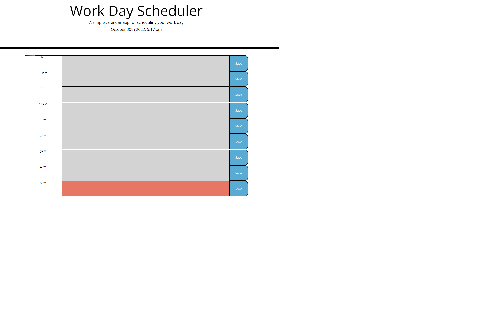

# DailyCalendar, by Mark Calcagno

## Description
A daily calendar where the user can record their routine, and the site will show them what event should occur at the pre-assigned time.

## Installation
The project runs in the browser, and does not require an installation

## Usage
When the user opens the page, the page will display the date and time.  The user can write their schedule in the description secion of the calendar.  Each hour is marked by a color: green for future hours, red for present, and gray for past.  Upon a refresh, the user should still see the schedule they created, due to their work being located in their local storage.

## Screenshot

## Credits
Mark Calcagno

## Links
The site: https://mcalcagno47.github.io/DailyCalendar/
My github: https://github.com/mcalcagno47/DailyCalendar   

## Updates
I do not forsee a reason to update this site, though I'm planning on implementing the features here in my project.
